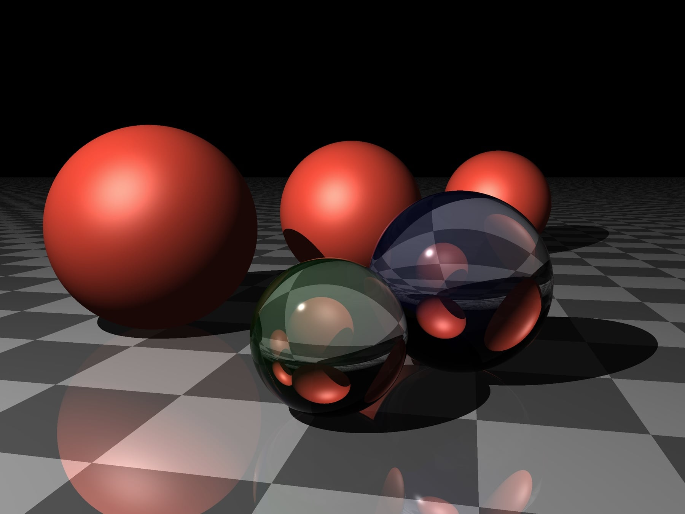

# Simple Ray Tracer in TypeScript



## Overview

This project is a simple ray tracer implemented in TypeScript. It aims to create basic 3D renderings with fundamental ray tracing techniques, focusing on simplicity and core concepts rather than advanced features.

## Features

- Basic shape rendering (spheres, planes)
- Simple lighting and shading
- Shadow casting
- Reflection and refraction (basic implementation)
- Scene composition
- Image output (PPM format)

## Technologies Used

- TypeScript
- Node.js
- Jest (for testing)

## Getting Started

### Prerequisites

- Node.js (v14 or later)
- npm (v6 or later)

### Installation

1. Clone the repository:

   ```
   git clone https://github.com/yourusername/simple-ray-tracer-ts.git
   ```

2. Navigate to the project directory:

   ```
   cd simple-ray-tracer-ts
   ```

3. Install dependencies:
   ```
   npm install
   ```

### Running the Ray Tracer

This command will compile the TypeScript code and execute the ray tracer. The output image will be saved in the `output` directory.

```
npm run build:run
```

### Running Tests

To run the test suite:

```
npm test
```

## Project Structure

- `src/`: Source code files
- `dist/`: Compiled JavaScript files
- `output/`: Generated images

## Contributing

Contributions are welcome! Please feel free to submit a Pull Request.

## License

This project is licensed under the ISC License - see the [LICENSE](LICENSE) file for details.

## Acknowledgments

- Inspired by "The Ray Tracer Challenge" by Jamis Buck
- Thanks to the TypeScript and Node.js communities for their excellent tools and documentation
